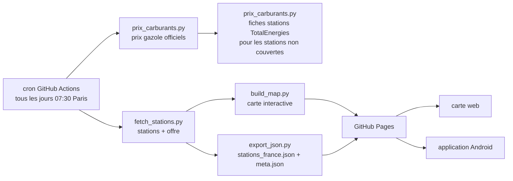

# Stations TotalEnergies — Opération Avantage Carburant

Liste complète des stations du réseau TotalEnergies, avec distinction de celles
qui participent à l'**Opération Avantage Carburant** (prix plafonné, l'offre
« Club TotalEnergies » réservée aux clients avec un contrat électricité/gaz),
et affichage de la **disponibilité et du prix du gazole**.

## Résultat (données du 24/09/2026)

| | Stations |
|---|---|
| Stations-service en France (une ligne par lieu) | **3 148** |
| dont **Avantage Carburant** | **2 071** (2 015 ouvertes) |
| dont **Avantage Carburant + adhésion Club en station** | **1 276** |
| sans l'offre | 1 077 |
| dont **gazole disponible** | **1 785** (prix de 2,190 à 2,843 €/L, médian 2,250) |
| dont prix plafonné repris de la fiche TotalEnergies | 203 |
| sans donnée gazole | 756 |

Par enseigne : Total 2 353 (1 362 avec l'offre) · TotalEnergies Access 709 (708)
· Élan 85 (0) · Elf 1 (1).

L'API décrit parfois un même lieu plusieurs fois, une fiche par type de point de
vente (« station-service » et « centre de lavage » par exemple). Le script ne
garde qu'**une ligne par lieu** (la fiche carburant) et fusionne les tags des
fiches : sans cela, 4 246 lignes pour 3 147 lieux, avec des valeurs
contradictoires pour la même adresse (l'offre présente sur la fiche carburant,
absente sur la fiche lavage).

## Deux périmètres possibles pour « l'opération à 1,99 € »

Les stations portent deux tags proches :

| Tag | Sens | Stations |
|---|---|---|
| `OpeAvantageCarburant` | l'offre Avantage Carburant (prix plafonné pour les clients Club avec contrat élec/gaz) | 2 071 |
| `Adhesionstation` | la station peut faire adhérer au Club TotalEnergies sur place | 1 276 avec l'offre |

Ces 1 276 stations correspondent à l'ordre de grandeur des « 1 200 stations »
communiqué par TotalEnergies pour l'opération de plafonnement. Sur l'exemple
vérifié : à Bayeux (16 bd Sadi Carnot) l'offre est présente **sans** adhésion en
station, à Vaucelles (20 av. de la Drôme) elle est présente **avec** adhésion —
seule différence de données entre les deux stations.

Le CSV expose les deux colonnes, la carte permet de cocher « adhésion Club en
station » pour ne retenir que le périmètre restreint.

## D'où viennent les données

L'application mobile et la page <https://services.totalenergies.fr/stations>
s'appuient sur le localisateur TotalEnergies (Woosmap / PoiFinder). Chaque
station y est décrite par une liste de `tags`, et le filtre **« Avantage
Carburant »** de la catégorie *Club TotalEnergies* correspond exactement au tag
`OpeAvantageCarburant` (« Opération Avantage Carburant »).

- `GET https://api.woosmap.com/stores/?key=<clé publique>&storesByPage=100&page=N`
  avec l'en-tête `Referer: https://services.totalenergies.fr/`
- 124 pages, 12 360 stations dans le monde, dont 4 723 en France (toutes
  enseignes et tous types de points de vente confondus).

D'après la fiche officielle de l'offre : prix plafonné **1,99 €/L** (1,94 €/L
depuis le 2 septembre 2024), tous carburants sauf GNL/GNR, dans la limite de
2 000 litres par année civile et 2 prises de carburant par jour, pour les
clients titulaires d'un contrat d'énergie TotalEnergies et membres du Club.
L'éligibilité est donc liée au couple **station participante + compte client**.

### Prix et disponibilité du gazole

Deux sources publiques se complètent.

**1. Le jeu de données officiel « Prix des carburants en France »**
(`data.economie.gouv.fr`, alimenté par les stations elles-mêmes et mis à jour
plusieurs fois par jour) :

- `GET https://data.economie.gouv.fr/api/explore/v2.1/catalog/datasets/prix-des-carburants-en-france-flux-instantane-v2/records`
- champs utilisés : `gazole_prix`, `gazole_maj`, `gazole_rupture_type`,
  `carburants_disponibles`, `carburants_indisponibles`
- rapprochement avec les stations Total par **proximité géographique** : même
  code postal d'abord (tolérance 300 m), sinon la station officielle la plus
  proche à moins de 150 m. **2 187 stations sur 3 148** sont appariées
  (distance médiane 46 m).

**2. La fiche publique de chaque station du localisateur TotalEnergies**
(API « PoiFinder » employée par le localisateur lui-même) :

- `GET https://apis.poifinder.alzp.tgscloud.net/poi-finder-store-locator-back/api/v1/point-of-interest?location_id=<référence>&type=FUELING`
  avec l'en-tête `API-Key` (clé publique lue dans `customdevs.woosmap.com/total/front.js`)
- elle donne, par carburant (`GO`, `GOEX`, `E10`, `SP8`, `E85`…), un **prix**,
  une **disponibilité** et une date de mise à jour ; interrogée uniquement pour
  les stations que le jeu officiel ne couvre pas
- **couverture partielle** : les stations de type « généraliste » (relais,
  garages) ne sont pas dans ce référentiel (réponse 404) — soit 1 024 des
  3 148 ; sur les 271 stations « retail » sans prix officiel, 203 ont été
  complétées et 2 déclarées sans gazole à la vente
- **le prix renvoyé est un prix plafonné national** (2,25 €/L pour le gazole),
  relevé une fois par jour : il est marqué comme tel sur la carte (**badge
  orange**, texte « prix plafonné ») et jamais confondu avec un prix déclaré.

Les stations sans donnée dans les deux sources sont marquées **« Inconnu »**,
jamais devinées.

États possibles dans la colonne `Gazole disponible` : `Oui`, `Non`
(rupture, temporaire ou définitive), `Non (non distribué)` et `Inconnu`.

## Fonctionnement sans ordinateur (GitHub Actions + Pages)

Le rafraîchissement ne dépend pas d'une machine personnelle :



L'action [`.github/workflows/maj-donnees.yml`](.github/workflows/maj-donnees.yml)
tourne tous les jours à 05:30 UTC (07:30 à Paris en heure d'été), au premier
`push` sur `main`, ou à la demande via le bouton **Run workflow**. Elle publie
sur GitHub Pages :

| URL | Contenu |
|---|---|
| `https://<utilisateur>.github.io/stations-total-1.99/` | la carte interactive |
| `…/stations_france.json` | stations compactes (771 Ko, 3 148 entrées) pour l'application |
| `…/meta.json` | version, horodatage, compteurs (pour savoir si le cache de l'app est à jour) |
| `…/stations_france.csv` | même données au format tableur |

Rien n'est committé dans le dépôt (les données sont ignorées par `.gitignore`) :
tout passe par le déploiement Pages, ce qui évite de faire grossir l'historique
d'un mois de données par an.

### Fréquence, coût, durée de vie

- **Fréquence** : une fois par jour, **07:30 heure de Paris** (`cron: '30 7 * * *'`
  associé à `timezone: "Europe/Paris"`, donc pas de décalage à l'heure d'hiver),
  plus à chaque `push` sur `main` et à la demande (*Actions → Run workflow*).
  GitHub peut retarder une tâche planifiée aux heures de pointe, d'où le choix de
  la minute 30 ; la granularité minimale d'une planification est de 5 minutes.
- **Coût : 0 €** — les GitHub Actions sont gratuites et sans quota de minutes sur
  un dépôt **public** avec les runners standard, et GitHub Pages est gratuit pour
  un dépôt public (limites : site publié ≤ 1 Go, bande passante ~100 Go/mois,
  déploiement ≤ 10 min ; notre site pèse ~2 Mo).
- **Durée de vie** : GitHub **désactive automatiquement** la planification d'un
  dépôt public resté *60 jours sans activité*. Comme la publication ne crée aucun
  commit, le workflow republie un petit `etat.json` à la racine dès que le dernier
  commit dépasse 45 jours (une poignée de commits par an), ce qui maintient la
  planification active.
- Le reste de la chaîne ne dépend de rien : pas de machine personnelle, pas de
  serveur, pas de clé API (les deux sources sont publiques).

**Mise en service** (une seule fois, à la main) :

```bash
git remote add origin https://github.com/Davidlouiz/stations-total-1.99.git
git push -u origin main
```

puis dans le dépôt : *Settings → Pages → Build and deployment → Source :
**GitHub Actions***. Il faut ensuite un premier passage de l'action (Run
workflow) pour que le site soit publié.

> Pages est gratuit pour un dépôt **public**. Pour un dépôt privé il faut GitHub
> Pro ; dans ce cas l'application Android a tout intérêt à interroger directement
> les APIs publiques (voir ci-dessous) plutôt que Pages.
>
> ⚠️ **Modifier ce workflow plus tard** : GitHub refuse à un jeton personnel qui
> n'a pas le scope `workflow` d'écrire dans `.github/workflows/`, ni en `git push`
> ni via l'API (« refusing to allow a Personal Access Token to create or update
> workflow … without `workflow` scope »). À ne pas confondre avec un problème
> d'accès au dépôt ou de SSH/HTTPS : soit le jeton porte le scope `workflow`, soit
> la modification se fait depuis l'interface web de GitHub.

## Application Android (sans serveur personnel)

Deux stratégies, combinables :

**A. L'application interroge directement les deux APIs publiques** (recommandé :
pas de serveur, données toujours fraîches, fonctionne même si le dépôt disparaît)

| Données | Appel |
|---|---|
| stations | `GET https://api.woosmap.com/stores/?key=<clé>&storesByPage=100&page=N` avec l'en-tête `Referer: https://services.totalenergies.fr/` — 124 pages |
| prix gazole | `GET https://data.economie.gouv.fr/api/explore/v2.1/catalog/datasets/prix-des-carburants-en-france-flux-instantane-v2/records?limit=100&offset=N&select=…` — ~98 pages |
| prix plafonné (complément) | `GET https://apis.poifinder.alzp.tgscloud.net/poi-finder-store-locator-back/api/v1/point-of-interest?location_id=<référence>&type=FUELING` avec l'en-tête `API-Key` — 1 appel par station « retail » non appariée (~270) |

Soit ~4 Mo en tout, à faire une fois par jour et à mettre en cache. La logique à
porter est celle de `fetch_stations.py` (dédoublonnage par `location_id`, lecture
du tag `OpeAvantageCarburant`) et de `prix_carburants.py` (rapprochement par
haversine : même code postal à 300 m, sinon 150 m) — une centaine de lignes de
Kotlin. L'application peut alors trier par distance au GPS du téléphone.

**B. L'application télécharge `stations_france.json` depuis GitHub Pages**

Plus simple : un seul fichier de 771 Ko, déjà dédoublonné et apparié aux prix,
à comparer à `meta.json` pour ne le retélécharger que si `version` a changé.
C'est le mode « hors ligne » naturel : embarquer le JSON dans les assets de
l'application et le rafraîchir en tâche de fond.

Dans les deux cas, aucun serveur personnel n'est nécessaire. Le format de
`stations_france.json` est décrit dans `data/meta.json` (champ `champs`) :
`id`, `nom`, `ens`, `adr`, `cp`, `vil`, `dep`, `lat`, `lng`, `st`, `h24`, `av`,
`cl`, `gz`, `pr`, `mj`, `gs` (origine du prix : `officiel` ou `total`),
`gp` (vrai si le prix est plafonné), `gid`.

## Option : mise à jour locale (systemd)

Utile si l'on veut des données fraîches sur la machine sans attendre l'action
GitHub, ou pour travailler hors ligne. Ce n'est plus le mécanisme principal :

| Unité | Rôle |
|---|---|
| `stations-total-refresh.timer` | déclenche le rafraîchissement chaque jour à **07:30** (`RandomizedDelaySec=600`, `Persistent=true`) |
| `stations-total-refresh.service` | relance `fetch_stations.py --refresh` puis `build_map.py` (~1 min) |
| `stations-total-web.service` | sert la carte en permanence sur <http://localhost:8000/data/carte.html> |

Installation (déjà faite sur cette machine) :

```bash
./install_services.sh            # timer + serveur web
./install_services.sh --no-web   # rafraîchissement seulement
```

Suivi et commandes utiles :

```bash
systemctl --user list-timers stations-total-refresh.timer
systemctl --user start stations-total-refresh.service   # rafraîchir maintenant
journalctl --user -u stations-total-refresh.service -n 50
systemctl --user status stations-total-web.service
```

Désinstallation :

```bash
systemctl --user disable --now stations-total-refresh.timer stations-total-web.service
rm ~/.config/systemd/user/stations-total-*.*
systemctl --user daemon-reload
```

Le rafraîchissement ne tourne que lorsque la session est ouverte ; pour qu'il
fonctionne aussi PC verrouillé ou déconnecté, activer le *linger* :

```bash
sudo loginctl enable-linger $USER
```

La date et l'heure de génération sont rappelées en haut de la carte
(« données générées le 24/09/2026 à 11:19 ») : recharge la page pour voir la
dernière version.

## Utilisation

Aucune dépendance : Python 3 standard uniquement.

```bash
python3 fetch_stations.py     # stations + prix gazole -> data/stations.json + CSV
python3 build_map.py          # carte -> data/carte.html
python3 export_json.py        # export mobile -> data/stations_france.json + meta.json
```

Un seul appel réseau suffit pour tout produire : `export_json.py` et
`build_map.py` réutilisent les caches `data/stations.json` et
`data/prix_carburants.json`.

Options utiles :

```bash
python3 fetch_stations.py --refresh    # force le retéléchargement (sinon cache)
python3 fetch_stations.py --tous-poi   # inclut lavages, bornes de recharge, aviation
python3 fetch_stations.py --tous-pays  # monde entier au lieu de la France
python3 fetch_stations.py --sans-prix  # sans les prix gazole
python3 build_map.py --refresh         # données fraîches + carte en une fois
```

Le cache des prix officiels (`data/prix_carburants.json`) est réutilisé tant
qu'il a moins de 6 heures, puis rafraîchi automatiquement. Les fiches stations
(`data/prix_total.json`) suivent la même règle ; une station absente du
référentiel Total y est mémorisée vide, pour ne pas la redemander.

## Fichiers produits

| Fichier | Contenu |
|---|---|
| `fetch_stations.py` | récupération des stations + export CSV |
| `prix_carburants.py` | récupération des prix officiels + rapprochement géographique + complément par les fiches stations TotalEnergies (prix plafonné) |
| `build_map.py` | génération de la carte interactive |
| `export_json.py` | export compact `stations_france.json` + `meta.json` (application mobile) |
| `resume.py` | résumé des données générées (console et résumé de job GitHub Actions) |
| `.github/workflows/maj-donnees.yml` | rafraîchissement quotidien + publication GitHub Pages |
| `install_services.sh`, `systemd/` | variante locale optionnelle (timer + serveur web) |
| `data/stations.json` | cache brut de l'API TotalEnergies (toutes les stations du monde) |
| `data/prix_carburants.json` | cache des prix officiels (9 804 stations) |
| `data/prix_total.json` | cache des fiches stations TotalEnergies (prix plafonné) |
| `data/stations_france.csv` | la liste, séparateur `;`, BOM UTF-8 : s'ouvre directement dans Excel / LibreOffice |
| `data/stations_france.json` | export compact pour l'application Android (~890 Ko) |
| `data/meta.json` | horodatage, compteurs, description des champs |
| `data/carte.html` | carte interactive autonome (Leaflet + OpenStreetMap, internet requis pour le fond de carte) |

### Colonnes du CSV

`Enseigne` · `Type` · `Lieu` · `Nom` · `Adresse` · `Code postal` · `Ville` ·
`Département` · `Latitude` · `Longitude` · `Statut` · `Ouvert 24/24` ·
**`Avantage Carburant`** (OUI/NON) · **`Adhésion Club en station`** (Oui/Non) ·
**`Gazole disponible`** · **`Prix gazole (€/L)`** · `Source du prix` · `MAJ gazole` ·
`Rupture gazole` · `Autres offres` · `ID station`

Pour ne garder que les stations participantes : filtrer `Avantage Carburant = OUI`.
Pour le périmètre restreint : `Avantage Carburant = OUI` **et** `Adhésion Club en station = Oui`.
Pour les stations avec du gazole : filtrer `Gazole disponible = Oui`.

### Carte interactive

- Marqueurs **verts** = Avantage Carburant, **gris** = sans l'offre.
- Boutons `Toutes` / `Avantage Carburant` / `Sans l'offre`, cases
  **adhésion Club en station** et masquage des stations fermées, filtres par
  enseigne, département, **gazole** (disponible / indisponible / donnée inconnue)
  et **prix gazole maximum**, tri (département, ville, enseigne, **prix du gazole**),
  recherche plein texte.
- Le prix du gazole, sa date de mise à jour et son origine (prix déclaré par la
  station ou prix plafonné de la fiche TotalEnergies, badge orange) s'affichent
  dans la liste et dans chaque infobulle.
- **Vérifier en direct** : bouton qui interroge le jeu de données officiel depuis
  le navigateur (aucun serveur intermédiaire) pour actualiser prix, ruptures et
  disponibilité des stations affichées. Les stations déclarent leurs données
  environ toutes les 10 minutes : c'est le moyen de contrôler à 18 h ce qui a
  changé depuis la passe du matin. Le bouton **Autour de moi** enchaîne
  automatiquement cette vérification. L'API officielle accepte les appels
  depuis le navigateur (CORS ouvert) ; celle de TotalEnergies non.
  automatiquement cette vérification. L'API officielle accepte les appels
  depuis le navigateur (CORS ouvert) ; celle de TotalEnergies non : le
  complément par fiches station se fait donc côté serveur, avant publication.
- Fond de carte **OpenStreetMap** (tuiles `tile.openstreetmap.org`).
- Un clic sur une ligne de la liste recentre la carte sur la station.

## Limites

- L'API utilisée est une API publique de site, non documentée : elle peut
  changer sans préavis. En cas de rupture, relancer `--refresh` et vérifier
  l'en-tête `Referer` ainsi que la clé dans `fetch_stations.py`.
- Les données sont celles du référentiel TotalEnergies (mise à jour quotidienne
  côté source) : un changement d'offre peut mettre quelques jours à apparaître.
- Le prix du gazole est daté (colonne `MAJ gazole`) et peut avoir quelques
  heures de retard selon la station. Les prix repris des fiches stations
  TotalEnergies (badge orange) sont des **prix plafonnés nationaux**, relevés une
  fois par jour : ils peuvent différer du prix réellement affiché à la pompe
  (constaté sur ~4 % des stations comparées, jusqu'à 0,25 €/L d'écart).
- **Un seul « Gazole » côté officiel** : le jeu de données de l'État ne déclare
  qu'un gazole par station, le gazole standard. Or TotalEnergies référence
  **deux** diesels distincts (codes `GO` et `GOEX`), tous deux affichés
  « Diesel Premier » dans leur propre outil, avec des disponibilités
  **indépendantes** : l'un peut être en rupture et l'autre non (vérifié sur 23
  stations, les quatre combinaisons existent). Les colonnes
  `Gazole disponible` / `Prix gazole` décrivent donc le gazole standard et ne
  disent rien de l'autre diesel. `<br>Diagnostic : `python3 probe_diesels.py``
- Un rapprochement géographique peut, rarement, associer une station voisine
  (même code postal, moins de 300 m) : la colonne `ID station` permet de
  vérifier au besoin sur <https://locator.totalenergies.com/>.
- Les 2 071 stations portant le tag `OpeAvantageCarburant` sont confirmées par
  les deux API TotalEnergies et par la fiche publique de chaque station (section
  « Fidélité ») ; l'icône affichée par l'application mobile peut néanmoins
  correspondre au sous-ensemble avec adhésion Club (1 276). Comparer les deux
  périmètres avant de conclure.
- Le statut « Fermé temporairement » provient de la source ; utiliser
  `Statut = Ouvert` pour une liste fiable.
- La carte nécessite internet (Leaflet est chargé depuis un CDN, le fond de
  carte depuis OpenStreetMap France / IGN).
